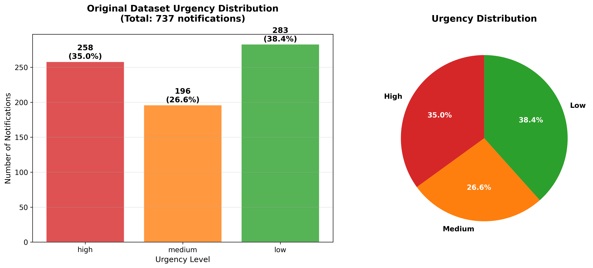
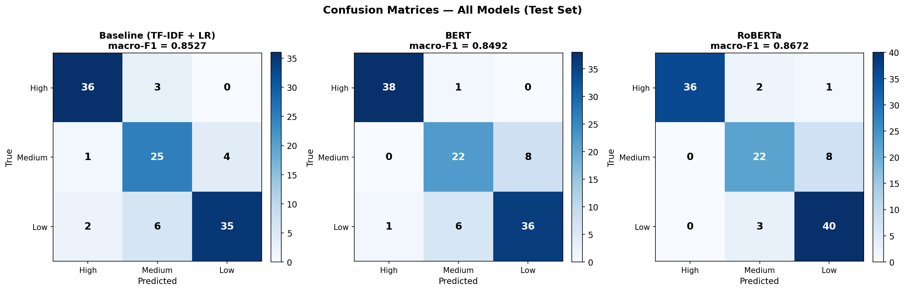

# Code Documentation
### Notification Priority Classification Using Semantic Analysis

**Authors:** Oliver Holmes, Sofia Bonoan, Denis Sokolov, Gonzalo Fernández
**Course:** Natural Language Processing — IE University, 2025/26
**Companion paper:** `NLP_Course_Project_26_GB_projectGroup10.pdf`

This document describes the code base that implements the experiments reported
in the paper. It is meant as a practical guide to *what each file does, how to
run it, and where the outputs end up*. The research motivation, the related
work, and the interpretation of results are in the paper; here we focus on
reproducibility.

---

## 1. Scope

The repository implements an end-to-end pipeline for classifying smartphone
notifications into three urgency levels (`High`, `Medium`, `Low`) from the raw
notification text. Concretely, the code covers:

1. Loading and cleaning the curated dataset (737 notifications).
2. A privacy-preserving anonymization step over the `notif_content` field.
3. A stratified 70/15/15 train/val/test split, saved as CSV.
4. Two families of models:
   a. A TF-IDF + Logistic Regression baseline.
   b. Fine-tuned transformer encoders (`bert-base-uncased`, `roberta-base`).
5. A unified evaluation layer: classification metrics (macro-F1, per-class F1)
   and a ranking check based on a `PriorityScore`.
6. A small full-stack demo that classifies live Gmail messages in real time.

Every figure referenced in the paper is regenerated by the notebooks and saved
under `results/figures/` in `.png`, `.pdf`, and `.svg`.

---

## 2. Repository layout

```
.
├── README.md                                # High-level project overview
├── CODE_DOCUMENTATION.md                    # This file
├── requirements.txt                         # Python dependencies
├── NLP_Notifications_final.dataset.csv      # Curated raw dataset (742 rows)
│
├── scripts/
│   ├── data_preprocessing.py                # CSV -> clean, anonymized splits
│   └── train_transformer.py                 # BERT / RoBERTa fine-tuning CLI
│
├── data/
│   ├── raw/                                 # (unused — curated set is in root)
│   └── processed/
│       ├── notifications_train.csv          # 519 rows
│       ├── notifications_val.csv            # 109 rows
│       └── notifications_test.csv           # 109 rows
│
├── notebooks/
│   ├── 01_data_exploration.ipynb            # EDA, class balance, apps, lengths
│   ├── 02_feature_extraction.ipynb          # TF-IDF + BERT [CLS] embeddings
│   ├── 03_modeling.ipynb                    # Baseline (LR) training
│   └── 04_evaluation.ipynb                  # Unified model comparison
│
├── cluster/
│   ├── setup_env.sh                         # One-shot HPC environment setup
│   └── train_bert.sh                        # SLURM job: train BERT + RoBERTa
│
├── models/                                  # Saved artefacts (tfidf, LR, cached CLS)
│
├── results/
│   ├── baseline/                            # val_metrics.json + test_predictions.csv
│   ├── bert-base-uncased/                   # same schema, plus best_model/
│   ├── roberta-base/                        # same schema, plus best_model/
│   ├── figures/                             # All paper figures (png/pdf/svg)
│   └── results_table.csv                    # Final consolidated table
│
└── demo/                                    # Optional live-classification app
    ├── backend/                             # FastAPI + Gmail poller
    └── frontend/                            # Vite + React UI
```

---

## 3. Dataset format

Both the raw CSV (`NLP_Notifications_final.dataset.csv`) and the processed splits share the same schema:

| Column          | Type   | Example                                                           |
|-----------------|--------|-------------------------------------------------------------------|
| `timestamp`     | str    | `10/03/2026 14:20:00`                                             |
| `app_name`      | str    | `macOS`, `Gmail`, `WhatsApp`, ...                                 |
| `notif_type`    | str    | `alert`, `message`, `email`, `reminder`, `ping`                   |
| `notif_content` | str    | `Don't dismiss: your disk is not encrypted ...`                   |
| `urgency`       | label  | `high` / `medium` / `low` (lower-cased in the processed splits)   |

The overall class distribution is 258 / 196 / 283 (`high` / `medium` / `low`) —
see `results/figures/fig1_overall_urgency_distribution.png`.
App and content-length breakdowns are in `fig2_app_distribution.png` and
`fig3_text_length_analysis.png`.



---

## 4. Preprocessing — `scripts/data_preprocessing.py`

Run it once to generate the processed CSVs:

```bash
python scripts/data_preprocessing.py \
  --input NLP_Notifications_final.dataset.csv \
  --output data/processed \
  --test-size 0.15 \
  --val-size 0.15
```

The `NotificationPreprocessor` class performs, in order:

1. **Load** the raw CSV (742 rows).
2. **Analyse** distributions (urgency, app, type, content length) and print a
   summary.
3. **Clean** each `notif_content`: strip, collapse whitespace, keep
   punctuation and casing (they carry urgency signal — e.g. `!`, `URGENT`).
4. **Anonymise** with regex patterns defined in `self.privacy_patterns`:

   | Pattern    | Regex (abbrev.)          | Placeholder |
   |------------|--------------------------|-------------|
   | email      | `\b...@...\.tld\b`       | `<EMAIL>`   |
   | URL        | `https?://...`           | `<URL>`     |
   | phone      | `+\d{1,3}? [\d()-]{8,15}`| `<PHONE>`   |
   | money      | `$/€/£ \d+\.?\d*`        | `<AMOUNT>`  |
   | long ints  | `\b\d{4,}\b`             | `<NUMBER>`  |

   `<NAME>` placeholders already present in the raw file are kept as-is.
   A total of 76 tokens were replaced on this dataset (see
   `fig5_preprocessing_quality.png` and `fig6_before_after_comparison.png`).
5. **Drop** rows with empty content after cleaning (5 were removed → 737).
6. **Stratified split** per urgency class, with `random.seed(42)`, into
   70.4% / 14.8% / 14.8%. The per-class counts are printed and the class
   balance is preserved across splits — see
   `fig4_data_splits_analysis.png`.
7. **Write** the three CSVs under `data/processed/` with the original schema.

---

## 5. Feature extraction — `notebooks/02_feature_extraction.ipynb`

Two independent representations are built on top of the processed splits:

### 5.1 TF-IDF (baseline)

```python
TfidfVectorizer(
    ngram_range=(1, 2),
    max_features=500,
    sublinear_tf=True,
    min_df=2,
    strip_accents='unicode',
    lowercase=True,
)
```

Fitted on `X_train` **only** (no val/test leakage). Produces sparse matrices
of shape `(n_rows, 500)`. The vectoriser is pickled to
`models/tfidf_vectorizer.pkl` so that the baseline notebook and the demo
backend can reuse it.

Per-class top terms (Fig. 7 in the paper,
`results/figures/fig7_tfidf_top_features.png`) are computed by taking the
mean TF-IDF weight across documents of each class and keeping the top 15.
They match the qualitative expectations:

* **High** — time-pressure / security tokens: *minutes, code, account*
* **Medium** — scheduling tokens: *available, pm, tonight*
* **Low** — social / informational: *sent, name, photo*

### 5.2 BERT tokenisation stats

Using `AutoTokenizer.from_pretrained('bert-base-uncased')`, every notification
is encoded with special tokens to compute its length. Key percentiles (all
737 rows): mean 15.4, median 15, p95 25, max 98. **99.7% of notifications fit
in 64 tokens**, which is why `max_len=64` is used in the training script.
The distribution per class is in `fig8_token_length_distribution.png`.

### 5.3 Pre-trained [CLS] embeddings

For a sanity check, we pass all 737 notifications through `bert-base-uncased`
**without fine-tuning**, extract the `[CLS]` last-hidden-state vector
(768-d), cache it to `models/cls_embeddings.npy` and
`models/cls_labels.npy`, and project it to 2-D with t-SNE
(`perplexity=30`, `init='pca'`, `n_iter=1000`).

![t-SNE of pre-trained BERT [CLS] embeddings](results/figures/fig9_tsne_bert_embeddings.png)

The three classes are already partially separable before any fine-tuning,
confirming that the pretrained encoder picks up urgency-related structure
from its general-domain pretraining.

---

## 6. Modelling

### 6.1 Baseline — `notebooks/03_modeling.ipynb`

The baseline is a class-balanced logistic regression on the 500-d TF-IDF
features:

```python
LogisticRegression(C=1.0, class_weight='balanced', max_iter=1000)
```

`class_weight='balanced'` compensates for the slight `low`-class majority.
The trained model is saved to `models/baseline_lr.pkl`, and the same test
predictions (with per-class softmax probabilities) are written to
`results/baseline/test_predictions.csv` so that the evaluation notebook can
consume all three models through one code path.

### 6.2 Transformers — `scripts/train_transformer.py`

A single CLI script fine-tunes any HuggingFace `AutoModelForSequenceClassification`
checkpoint. It was invoked twice, once for each encoder:

```bash
python scripts/train_transformer.py \
  --model_name bert-base-uncased \
  --data_dir   data/processed \
  --output_dir results/bert-base-uncased \
  --epochs 5 --batch_size 16 --lr 2e-5 --max_len 64 --patience 2 --seed 42

python scripts/train_transformer.py \
  --model_name roberta-base \
  --output_dir results/roberta-base \
  # (other flags identical)
```

Hyper-parameters summary:

| Parameter         | Value                                    |
|-------------------|------------------------------------------|
| Max seq. length   | 64 tokens                                |
| Batch size        | 16                                       |
| Learning rate     | 2e-5                                     |
| Optimiser         | AdamW, weight decay = 0.01               |
| LR schedule       | Linear, 10% warmup                       |
| Epochs (max)      | 5                                        |
| Early stopping    | patience = 2 on val macro-F1             |
| Loss              | Class-weighted cross-entropy (`w_c = N / (3·n_c)`) |
| Gradient clipping | `max_norm = 1.0`                         |
| Seed              | 42                                       |

The script uses mini-batches and `torch.softmax` on the logits to persist
per-class probabilities, which are needed for the ranking evaluation.
The best checkpoint (highest val macro-F1) is written to
`<output_dir>/best_model/`, the full history to `val_metrics.json`, and the
test-set predictions to `test_predictions.csv`.

### 6.3 HPC cluster — `cluster/`

`cluster/setup_env.sh` creates a `conda` env with torch + transformers on
the IE University HPC (NVIDIA RTX 6000 Ada, 48 GB). `cluster/train_bert.sh`
is the SLURM submission script (partition `gpu`, `--gres=gpu:1`, 2 h
wall-clock) that runs BERT then RoBERTa back-to-back and copies the
artefacts back under `results/`.

---

## 7. Evaluation — `notebooks/04_evaluation.ipynb`

The evaluation notebook is model-agnostic: it globs
`results/*/test_predictions.csv` and treats every file with the
`{text, true_label, pred_label, prob_low, prob_medium, prob_high}` schema
identically. This made it straightforward to add the transformer results
after the cluster job finished, without editing any evaluation code.

**Classification metrics** on the held-out test set (109 notifications):

| Model                     | Accuracy | Macro-F1 | F1-High | F1-Medium | F1-Low |
|---------------------------|:--------:|:--------:|:-------:|:---------:|:------:|
| Baseline (TF-IDF + LR)    |  0.857   |  0.853   |  0.923  |   0.781   | 0.854  |
| BERT (`bert-base-uncased`)|  0.857   |  0.849   |  0.974  |   0.746   | 0.828  |
| RoBERTa (`roberta-base`)  |  0.875   |  **0.867** | 0.960 |   0.772   | 0.870  |

Best val macro-F1 during training: **0.899** for BERT and **0.909** for
RoBERTa, so both transformers did generalise slightly worse to the test set
than to the validation set — consistent with the small test size (109 rows).

Confusion matrices side-by-side: `results/figures/fig11_confusion_matrices.png`.
Per-class F1 comparison bar chart: `fig12_per_class_f1.png`. On all three
models, the `medium` class is the hardest, which is expected: `medium`
messages sit between time-sensitive alerts and purely informational pings
and frequently share vocabulary with both neighbours.



**Ranking evaluation.** We compute:

$$\text{PriorityScore} = P(\text{High}) + 0.5 \cdot P(\text{Medium})$$

and sort the test set by descending score. `Precision@k` counts how many of
the top-`k` positions are truly `High`.

| Model                  |  P@5 | P@10 | P@20 |
|------------------------|:----:|:----:|:----:|
| Baseline (LR)          | 1.00 | 1.00 | 0.95 |
| BERT                   | 1.00 | 1.00 | 1.00 |
| RoBERTa                | 1.00 | 1.00 | 1.00 |
| Random baseline (≈ 38/109) | 0.35 | 0.35 | 0.35 |

See `fig13_precision_at_k.png` and `fig14_ranking_strip.png` (the strip plot
shows every test notification ordered by PriorityScore, coloured by true
label — a good ranker keeps red `high` samples on the left).

The consolidated numbers used in the paper are stored in
`results/results_table.csv`.

---

## 8. Reproducing the full pipeline

From a fresh clone:

```bash
# 1. Python env
python -m venv .venv && source .venv/bin/activate
pip install -r requirements.txt

# 2. Preprocessing (writes data/processed/*.csv)
python scripts/data_preprocessing.py --input NLP_Notifications_final.dataset.csv

# 3. Notebooks 01 -> 04 (run top-to-bottom, in order).
#    Notebook 03 writes models/tfidf_vectorizer.pkl, models/baseline_lr.pkl,
#    and results/baseline/{val_metrics.json,test_predictions.csv}.
jupyter notebook

# 4. Transformer fine-tuning (needs a GPU; ~15 min/model on an RTX 6000 Ada)
python scripts/train_transformer.py --model_name bert-base-uncased \
        --output_dir results/bert-base-uncased
python scripts/train_transformer.py --model_name roberta-base \
        --output_dir results/roberta-base

# 5. Re-run notebook 04 to regenerate the comparison tables / figures.
```

Fixed seeds (`seed=42` in both scripts) keep the splits and training
deterministic; small run-to-run drift on the transformer side comes from
CUDA non-determinism, not from the data side.

---

## 9. Demo application — `demo/`

An optional end-to-end demo is included under `demo/`. The FastAPI backend
(`demo/backend/main.py`) loads the three trained artefacts at start-up:

```
models/tfidf_vectorizer.pkl
models/baseline_lr.pkl
results/bert-base-uncased/best_model/
results/roberta-base/best_model/
```

It exposes three endpoints — `POST /classify-all`, `GET /stream` (Server-Sent
Events), and `GET /model-stats` — and can optionally poll an authenticated
Gmail inbox every 10 seconds, classifying each new message with all three
models. The React frontend (`demo/frontend/`, Vite + Tailwind + Recharts)
renders a live feed, a manual test tab, and a leaderboard built from each
`val_metrics.json`. See `demo/README.md` for the full OAuth setup.

The demo is *not* required to reproduce the paper's numbers; it is included
to illustrate that the same artefacts used offline can be served online
without modification.

---

## 10. Known limitations

A few limitations of the code base worth flagging, which also suggest
concrete next steps.

### 10.1 Negation coverage in the training set

A retrospective inspection of the dataset showed that our training split
contains very few examples with explicit negation (phrases such as *"your
payment did NOT fail"*, *"the meeting is not today"*, *"no action
required"*). This is a real evaluation concern rather than a cosmetic one:

* The TF-IDF baseline is unigram/bigram based. Strong urgency tokens like
  *failed*, *urgent*, *now* dominate the weight vectors regardless of a
  preceding *"no"* or *"not"*. A handful of manually constructed negated
  probes we tried at the end of the project flipped from `low` to `high`
  essentially on the keyword alone.
* The transformers are less brittle — attention over the full window does
  pick up the negator to some extent — but they were never explicitly
  trained against such counter-examples, so their behaviour on negated
  inputs is under-constrained and we do not have numbers for it.

The cheapest fix would be a small data-augmentation pass that, for a subset
of `high` training notifications, inserts the negated counterpart with a
flipped label (`high` → `low` or `medium`). The preprocessing script
already keeps punctuation and casing, so such examples would flow through
without changes. We consider this the single most useful follow-up on the
data side.

### 10.2 Small test set

The test split has only 109 rows, so single-example mistakes move macro-F1
by ~1 point. Confidence intervals on Table V of the paper should therefore
be read generously; cross-validation or a larger curated split would be
the clean fix.

### 10.3 App-name bias

`fig2_app_distribution.png` shows that a handful of apps (Gmail, WhatsApp,
iOS) account for most of the dataset. The models only see `notif_content`,
so this does not directly leak, but the *vocabulary* inherits the app mix.
A production system would need a more even app coverage and, ideally,
user-level splits to avoid evaluating on the same senders the model was
trained on.

### 10.4 English-only

All notifications are in English. Any multilingual deployment would
require either multilingual checkpoints (e.g. `xlm-roberta-base`) or
translation-based preprocessing.

---

## 11. File index

Quick pointers to the most important source files:

| Component                     | File                                                   |
|-------------------------------|--------------------------------------------------------|
| Raw curated dataset           | `NLP_Notifications_final.dataset.csv`                  |
| Preprocessing pipeline        | `scripts/data_preprocessing.py`                        |
| Transformer training CLI      | `scripts/train_transformer.py`                         |
| SLURM job                     | `cluster/train_bert.sh`                                |
| EDA                           | `notebooks/01_data_exploration.ipynb`                  |
| Feature extraction + t-SNE    | `notebooks/02_feature_extraction.ipynb`                |
| Baseline training             | `notebooks/03_modeling.ipynb`                          |
| Unified evaluation            | `notebooks/04_evaluation.ipynb`                        |
| Consolidated results table    | `results/results_table.csv`                            |
| All figures                   | `results/figures/`                                     |
| Demo (FastAPI + React)        | `demo/`                                                |

---

## 12. AI usage disclaimer

Parts of this documentation were drafted with the help of an AI assistant,
used as a writing and review tool. All technical content (code, experimental
setup, hyper-parameters, numerical results, and limitation analysis) comes
from our own work on the project; the assistant was used to speed up
phrasing, table formatting, and cross-referencing of figures. Every claim,
number, and figure reference in this document was verified by a human
author against the repository before inclusion.