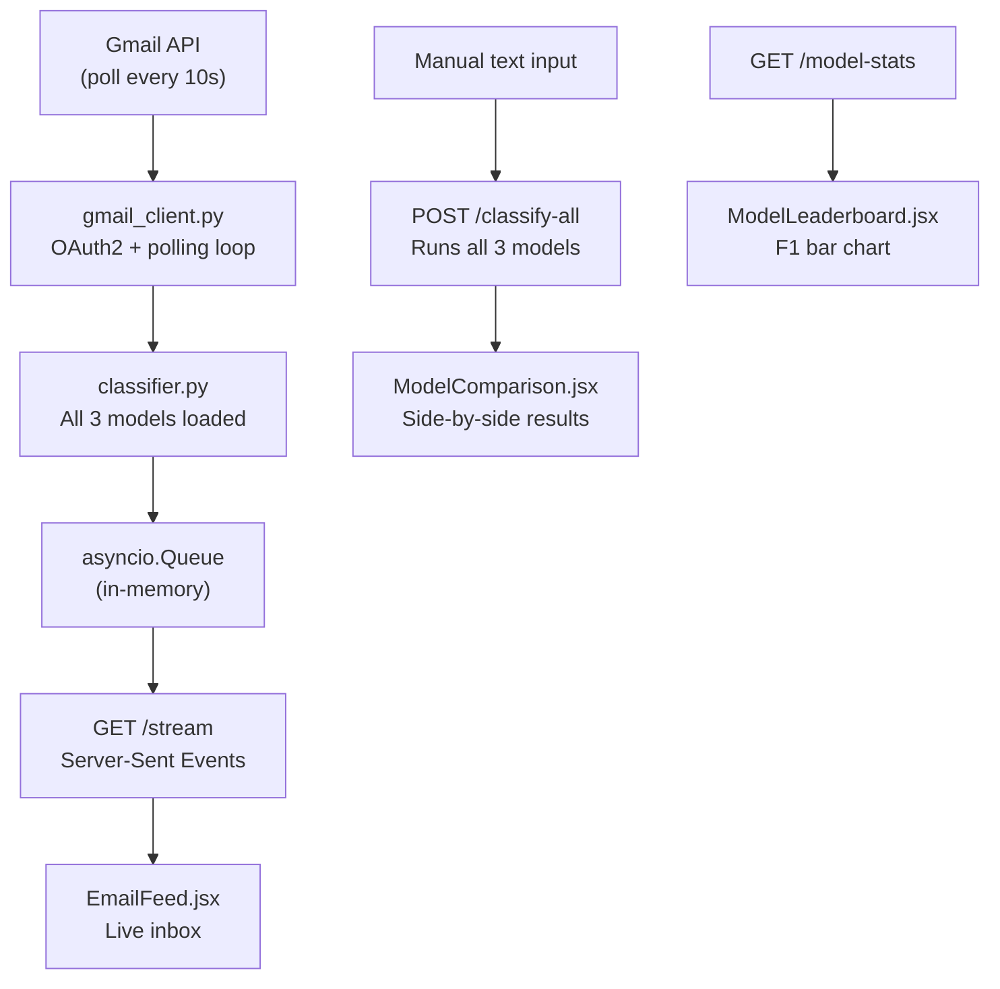

# Notification Priority Demo — Dev Plan

## What We Reuse

- [`scripts/data_preprocessing.py`](scripts/data_preprocessing.py) — `NotificationPreprocessor.privacy_patterns` regex + cleaning logic, copy directly into `classifier.py`
- [`results/roberta-base/best_model/`](results/roberta-base/best_model/) — RoBERTa weights + tokenizer (val F1: **0.951**)
- [`results/bert-base-uncased/best_model/`](results/bert-base-uncased/best_model/) — BERT weights + tokenizer (val F1: **0.844**)
- [`models/tfidf_vectorizer.pkl`](models/tfidf_vectorizer.pkl) + [`models/baseline_lr.pkl`](models/baseline_lr.pkl) — TF-IDF baseline (val F1: **0.756**)
- [`results/*/val_metrics.json`](results/roberta-base/val_metrics.json) — static performance data for the leaderboard tab

---

## Architecture



---

## Directory Structure

```
demo/
├── backend/
│   ├── main.py               # FastAPI app, all endpoints, SSE
│   ├── classifier.py         # loads all 3 models, preprocess + predict
│   ├── gmail_client.py       # OAuth2, polling loop, feeds queue
│   ├── requirements.txt
│   ├── credentials.json      # gitignored — download from Google Cloud
│   └── token.json            # gitignored — auto-generated on first login
└── frontend/
    ├── src/
    │   ├── App.jsx            # tab routing: Feed | Compare | Leaderboard
    │   └── components/
    │       ├── EmailFeed.jsx         # SSE-connected scrollable inbox
    │       ├── EmailCard.jsx         # single email row + urgency badge
    │       ├── ManualClassify.jsx    # free-text input → /classify-all
    │       ├── ModelComparison.jsx   # 3-model side-by-side panel
    │       └── ModelLeaderboard.jsx  # static F1/accuracy bar chart
    ├── package.json
    └── index.html
```

---

## Phase 1 — Model Server `~2 hrs`

**`demo/backend/classifier.py`**

Load all 3 models once at startup:
- RoBERTa and BERT via `transformers.pipeline("text-classification", model=path)`
- TF-IDF via `pickle.load` for both `tfidf_vectorizer.pkl` and `baseline_lr.pkl`

Copy the `privacy_patterns` regex dict from [`scripts/data_preprocessing.py`](scripts/data_preprocessing.py) (lines 32–39) and a `clean_text()` function that strips PII, lowercases, and truncates to ~64 tokens before inference.

Each model returns:
```json
{ "label": "high", "scores": { "high": 0.91, "medium": 0.07, "low": 0.02 } }
```

**`demo/backend/main.py`**

Three endpoints:
- `POST /classify-all` — takes `{ "text": "..." }`, runs all 3 models, returns array of results keyed by model name. Used by manual input and email click.
- `GET /stream` — SSE endpoint, drains `asyncio.Queue` and pushes each new classified email as a JSON event.
- `GET /model-stats` — reads all 3 `val_metrics.json` files and returns combined stats for the leaderboard.

Test Phase 1 in isolation with `curl` before any Gmail work.

---

## Phase 2 — Gmail Integration `~3 hrs`

**One-time Google Cloud setup (~30 min):**
1. [console.cloud.google.com](https://console.cloud.google.com) → New project → Enable Gmail API
2. Create OAuth 2.0 credentials (Desktop app type) → download `credentials.json` into `demo/backend/`
3. Add your Gmail as a test user in the OAuth consent screen
4. Add `credentials.json` and `token.json` to `.gitignore`

**`demo/backend/gmail_client.py`**

- First run: opens browser for OAuth → saves `token.json`
- Polling loop (every 10s):
  - Query: `q="is:unread after:<last_seen_epoch>"` via `users.messages.list`
  - For each new message: extract subject + body snippet (first ~200 chars)
  - Concatenate as `"{subject}. {snippet}"` — matches training data format
  - Pass through `classifier.classify_all(text)`
  - Push full result dict `{ id, sender, subject, time, predictions }` onto the `asyncio.Queue`
  - Mark email as read to avoid re-classifying

---

## Phase 3 — React Frontend `~3 hrs`

Bootstrap: `npm create vite@latest frontend -- --template react` then `npm install tailwindcss`.

**`App.jsx`** — three tabs: "Live Feed" | "Manual Test" | "Model Stats"

**`EmailCard.jsx`**
- Sender, subject, timestamp
- Urgency badge: color-coded pill (red = HIGH, amber = MEDIUM, green = LOW)
- Active model's confidence bar (3-segment bar showing probability split)
- Click to expand → triggers `ModelComparison` panel

**`EmailFeed.jsx`**
- Connects to `GET /stream` using `new EventSource("/stream")`
- Prepends new emails to top, keeps last 50
- Shows "Waiting for emails..." skeleton when empty

**`ManualClassify.jsx`**
- Textarea + "Classify" button
- Calls `POST /classify-all`, passes result to `ModelComparison`

**`ModelComparison.jsx`**
- Shows all 3 models in a row for the selected email/text
- Each column: model name, predicted label badge, confidence bar for all 3 classes
- Highlight the column where models disagree (border color changes)
- "Active model" (RoBERTa default) marked with a crown icon

**`ModelLeaderboard.jsx`**
- Fetches `GET /model-stats` once on mount
- Grouped bar chart (using `recharts`) showing val F1 and test F1 per model
- Table below with: Model | Val F1 | Test F1 | Val Acc | Notes
- Values from the existing metrics JSONs:

| Model | Val F1 | Test F1 |
|-------|--------|---------|
| TF-IDF + LR | 0.756 | 0.819 |
| BERT | 0.844 | 0.914 |
| RoBERTa | 0.951 | 0.891 |

---

## Phase 4 — Integration & Polish `~2 hrs`

- Run both services: `uvicorn main:app --reload` (port 8000) + `npm run dev` (port 5173)
- Configure Vite proxy so `/stream`, `/classify-all`, `/model-stats` forward to `localhost:8000` — no CORS issues
- Add loading spinner while models initialize (RoBERTa takes ~3s on first load)
- Send 5–6 test emails before the demo covering all 3 urgency levels
- Add `ModelSelector` dropdown in the Feed header — switches which model's label/badge is shown as the "primary" result (all 3 are always computed, just the display changes)

---

## .gitignore Additions

```
demo/backend/credentials.json
demo/backend/token.json
demo/frontend/node_modules/
demo/frontend/dist/
```

---

## Time Estimate

| Phase | Time |
|-------|------|
| Phase 1 — Model server | ~2 hrs |
| Phase 2 — Gmail OAuth + polling | ~3 hrs |
| Phase 3 — React frontend | ~3 hrs |
| Phase 4 — Integration + polish | ~2 hrs |
| **Total** | **~1 day** |
